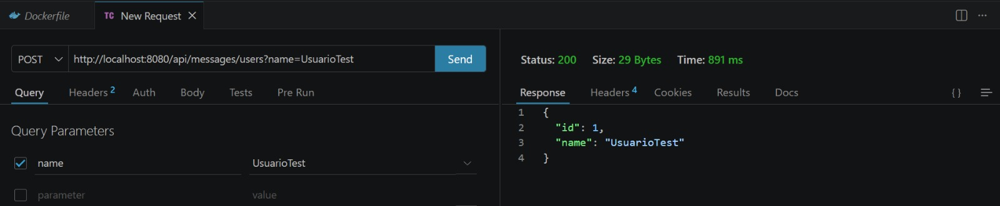
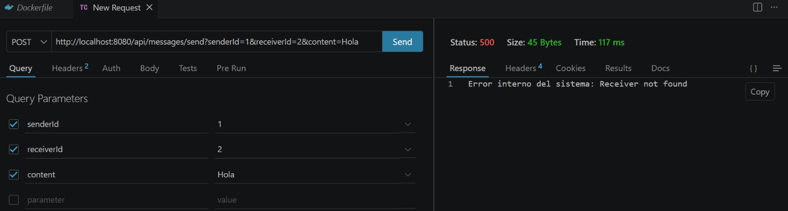
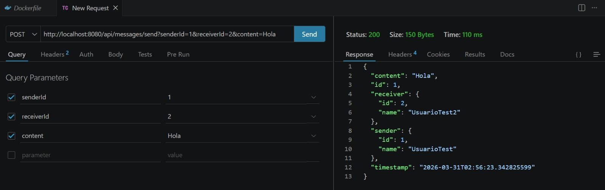
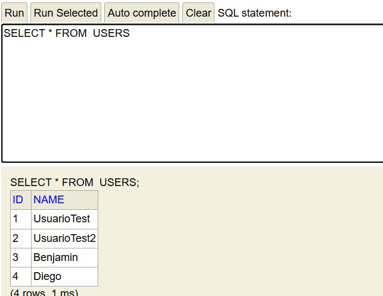
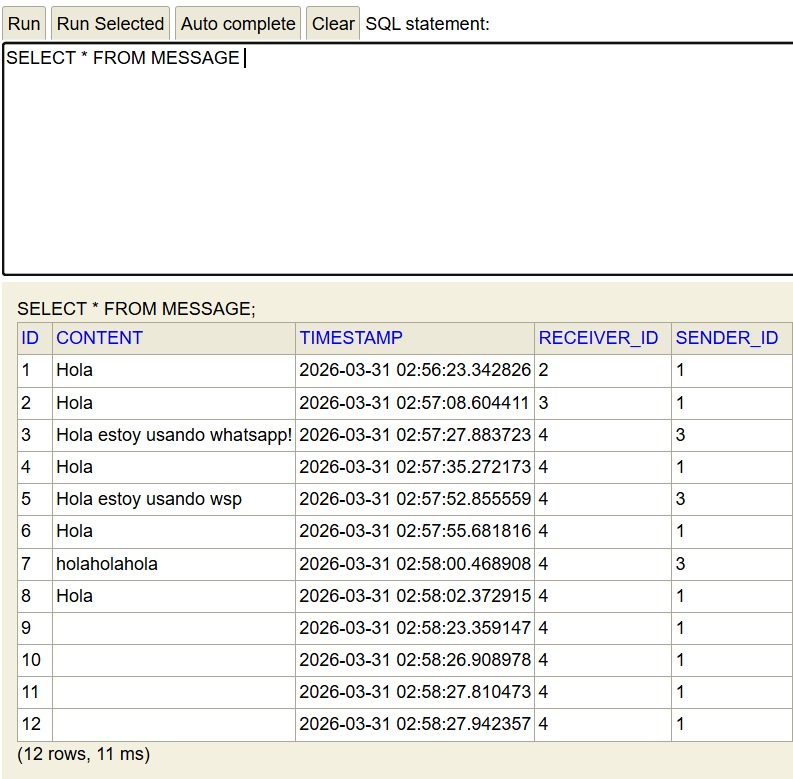

# Proceso de Despliegue Local del Proyecto con Docker

Este documento resume el paso a paso para construir y ejecutar el proyecto en Docker local.

## 1. Resumen del proyecto

- Repositorio base: `wsp2`
- Aplicacion principal: `wasap2/chat`
- Stack principal: Spring Boot + Maven + Java 17 + H2
- Puerto de la aplicacion: `8080`
- Dockerfile existente: `wasap2/chat/Dockerfile`

## 2. Paso a paso para Docker (local)

> Ejecutar estos pasos dentro de `wasap2/chat`.

### 3.1 Compilar el JAR

```powershell
cd wasap2/chat
./mvnw clean package
```

Salida esperada:

- Se genera un JAR en `target/`
- Dockerfile toma ese artefacto con `ARG JAR_FILE=target/*.jar`

### 3.2 Construir imagen Docker

```powershell
docker build -t wasap2-chat:0.0.1 .
```

### 3.3 Ejecutar contenedor

```powershell
docker run -d --name wasap2-chat -p 8080:8080 wasap2-chat:0.0.1
```

### 3.4 Verificar que la app funciona

1. Ver logs:

```powershell
docker logs -f wasap2-chat
```

2. Abrir en navegador:

- `http://localhost:8080`

3. (Opcional) listar contenedores:

```powershell
docker ps
```

### 3.5 Comandos utilizados en las pruebas

Comando de ejecucion usado:

```powershell
docker run -p 8080:8080 --name chat-container chat-microservice
```

Pruebas de endpoints usadas:

```http
POST http://localhost:8080/api/messages/users?name=UsuarioTest
POST http://localhost:8080/api/messages/send?senderId=1&receiverId=2&content=Hola
```

## 3. Comandos utiles de mantenimiento

Detener y eliminar contenedor:

```powershell
docker stop wasap2-chat
docker rm wasap2-chat
```

Eliminar imagen local:

```powershell
docker rmi wasap2-chat:0.0.1
```

Ver imagenes locales:

```powershell
docker images
```

## 4. Flujo recomendado completo (resumen rapido)

1. `./mvnw clean package` para generar JAR.
2. `docker build` para crear imagen.
3. `docker run` para validar localmente.
4. `docker logs -f` para revisar arranque y errores.
5. `docker stop` y `docker rm` para reiniciar despliegues limpios.

## 5. Evidencias (capturas)

### 5.1 Endpoints

Endpoint Creacion usuario:



Endpoint Manejo de Error:



Endpoint Mensaje:



### 5.2 Base de datos H2

H2 Usuarios:



H2 Mensajes:



---

